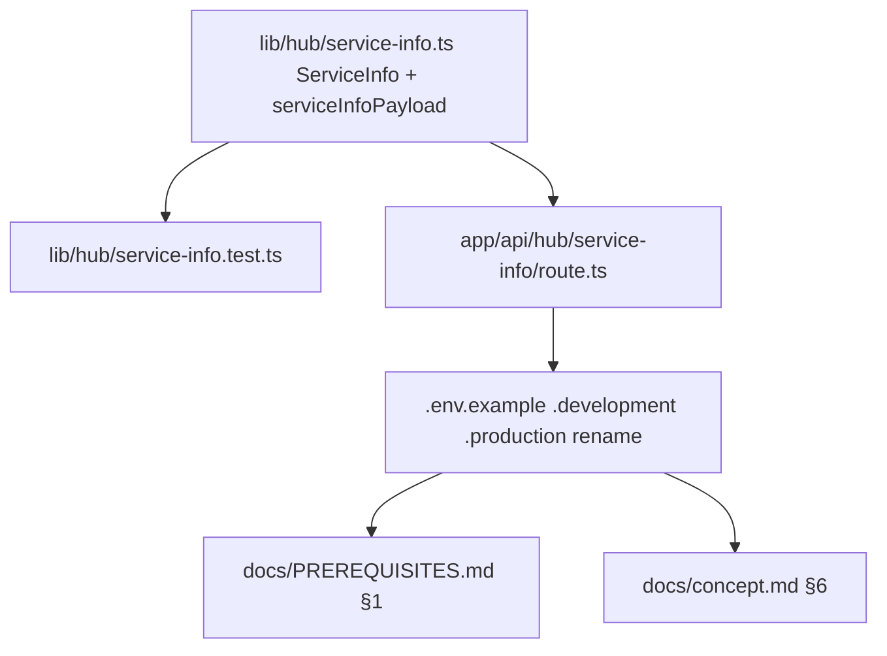

# _shared/hub-client 変更計画書 (O48 service-info v2 retrofit)

> **入力**: `./001_REVISE_SPEC.md`, `../../concept.md` §6, `lib/hub/service-info.ts` + route + test + .env*.example
> **最終更新**: 2026-05-28

---

## 1. 既存ファイル変更一覧

| ファイル | 変更内容 (概要) | リスク | 関連 SPEC § |
|---|---|---|---|
| `lib/hub/service-info.ts` | (1) `ServiceInfo` interface: `schemaVersion: 1` → `2`、`iconUrl?: string` 追加、(2) `serviceInfoPayload()` に第3引数 `siteUrl?: string` 追加 → 指定時 `iconUrl: siteUrl + "/icon.svg"` を payload に含める、(3) コメント rename `HUB_SHARED_SECRET` → `HUB_SERVICE_INFO_SECRET` | 低 (additive、型保護あり) | §7.3 |
| `app/api/hub/service-info/route.ts` | (1) env 参照 `process.env.HUB_SHARED_SECRET` → `process.env.HUB_SERVICE_INFO_SECRET`、(2) `serviceInfoPayload()` 呼び出しに `process.env.SITE_URL` を第3引数で渡す、(3) version 引数も `process.env.npm_package_version` を渡す (現在 undefined のため optional)、(4) コメント rename | 低 (env update が漏れると 401 だが、Release Phase 1 FILL で検出可能) | §7.1 / §7.2 |
| `lib/hub/service-info.test.ts` | (1) test name `HUB_SHARED_SECRET` → `HUB_SERVICE_INFO_SECRET`、(2) `serviceInfoPayload` test に `schemaVersion: 2` 反映、(3) `iconUrl` 検証 test 追加 (siteUrl 指定時 + 省略時)、(4) version 検証は既存維持 | 低 (test only) | §7.3 |
| `.env.example` | `HUB_SHARED_SECRET=change-me` → `HUB_SERVICE_INFO_SECRET=change-me` (コメント `# 全サービス共通` 追加) | 低 | §2.2 |
| `.env.development.example` | `HUB_SHARED_SECRET=dev-secret-not-for-production` → `HUB_SERVICE_INFO_SECRET=dev-secret-not-for-production` | 低 | §2.2 |
| `.env.production.example` | `HUB_SHARED_SECRET=replace-with-openssl-rand-hex-32` → `HUB_SERVICE_INFO_SECRET=replace-with-openssl-rand-hex-32` | 低 | §2.2 |
| `docs/PREREQUISITES.md` §1 | 表に新 row 追加: `HUB_SERVICE_INFO_SECRET` (用途: O48 service-info Bearer 認証 (全サービス共通)、取得方法: `openssl rand -hex 32` で生成 → HUB 側に同値共有) | 低 (ドキュメント) | §3 |
| `docs/concept.md` §6 (line 438) | `HUB_SHARED_SECRET`（env、Bearer 検証、読み取り専用） → `HUB_SERVICE_INFO_SECRET`（env、Bearer 検証、読み取り専用、全サービス共通）、`schemaVersion=2` + `iconUrl?` 言及追加 | 低 (ドキュメント) | §3 |

## 2. 新規ファイル一覧

| ファイル | 責務 | 依存 | LOC 見積 |
|---|---|---|---|
| (なし、既存ファイル改修のみ) | — | — | — |

## 3. 削除ファイル一覧

| ファイル | 削除理由 | 代替 |
|---|---|---|
| (なし) | — | — |

## 4. マイグレーション要否

- DB スキーマ変更: ❌
- 既存データ変換: ❌
- 設定ファイル変更: ✅ (`.env*.example` rename、`.env*.local` は運用者手動 = Release gate Phase 1 FILL で確認)
- ストレージパス変更: ❌

→ **Phase 5 REVISE_MIGRATION は生成不要** (DB 影響なし、env rename は通常設定変更でマイグレーション扱いではない)

## 5. 実装 Phase 分割 (/flow:tdd 連携)

### Phase 1 (RED→GREEN→IMPROVE): producer ロジック retrofit + env rename
- 対象: `lib/hub/service-info.ts` + `lib/hub/service-info.test.ts` + `app/api/hub/service-info/route.ts` + `.env.example` + `.env.development.example` + `.env.production.example`
- ゴール: 174 → 176 tests GREEN (+iconUrl test 1 + env rename test 1 想定、または既存 test 修正のみで net 0 の可能性)
- 検証: `npm run test -- --run` で全 GREEN

### Phase 2 (bookkeeping): ドキュメント同期
- 対象: `docs/PREREQUISITES.md` §1 + `docs/concept.md` §6
- ゴール: PREREQUISITES に `HUB_SERVICE_INFO_SECRET` 行追加、concept §6 表 + 言及 update
- 検証: grep で `HUB_SHARED_SECRET` が docs/ + lib/ + app/ + .env*.example に **0 件**残ること (`.env*.local` は git ignored で本 revise 対象外)

→ 両 Phase 軽 = メイン直接 (サブスキル委託せず、`/flow:tdd-phase` は使わない、`/flow:tdd` で連続実装)

## 6. 依存関係順序

Phase 1 内は core ロジック (P1A) → test (P1B) と route (P1C) を並列、env rename (P1D) は最後。Phase 2 ドキュメントは Phase 1 完了後。

## 7. ロールアウト計画

| ステップ | 内容 | 期日 | 検証方法 |
|---|---|---|---|
| 1. Phase 1 実装 | tdd で producer + test + env rename | 本セッション内 | npm run test GREEN |
| 2. Phase 2 ドキュメント | PREREQUISITES + concept §6 | 同 commit | grep で旧名 0 件 |
| 3. release-pre 必須監査 再実行 | retrofit 後 HEAD で `/flow:audit --scope=full` → `/flow:secure` | tdd 直後 | High 0、AUDIT-perspective-001 解消確認 |
| 4. Release Phase 3 デプロイ | `.env.production.local` 手動 rename → `vercel env update` → preview → prod | 監査 fresh 後 | HUB から `GET /api/hub/service-info` 実 pull で 200 + iconUrl 受信確認 |

## 8. リスク・注意点

- **`.env*.local` rename 漏れ**: 運用者が手動で `.env.development.local` + `.env.production.local` の env name を変えないと、デプロイ後 401 が返る。Release gate Phase 1 FILL の手順 (env-acquisition-guide.md) で必ず確認。
- **`vercel env`**: Vercel に登録済の `HUB_SHARED_SECRET` を `HUB_SERVICE_INFO_SECRET` に rename (削除 + 新規作成) する必要あり。値は同一。
- **HUB 側設定**: HUB が shipyard を pull する Bearer 値設定は変更不要 (運用者が新 env var に旧と同値を入れれば wire 互換)。HUB admin で shipyard 用 secret が登録済の場合はそのまま。

## 9. 完了の定義 (DoD)

- [ ] Phase 1 完了: producer + test + env rename (`.env*.example`)
- [ ] Phase 2 完了: PREREQUISITES + concept §6 同期
- [ ] `npm run test -- --run` で 174+ tests GREEN
- [ ] grep `HUB_SHARED_SECRET` で docs/ + lib/ + app/ + .env*.example に 0 件
- [ ] grep `HUB_SERVICE_INFO_SECRET` で **新コード + env*.example + docs/PREREQUISITES + docs/concept に存在**
- [ ] grep `iconUrl` で `lib/hub/service-info.ts` + `lib/hub/service-info.test.ts` に追加検出
- [ ] (release-pre 監査再実行で) AUDIT-perspective-001 解消 = High 0
- [ ] Release Phase 3 デプロイ後の HUB pull 実機確認 (本 revise の DoD ではなく Release gate の DoD)

## 10. 更新履歴
| 日付 | 変更概要 | 実行者 |
|---|---|---|
| 2026-05-28 | 初版作成 (AUDIT-perspective-001 撃ち落とし、auto-pick) | /flow:revise |
