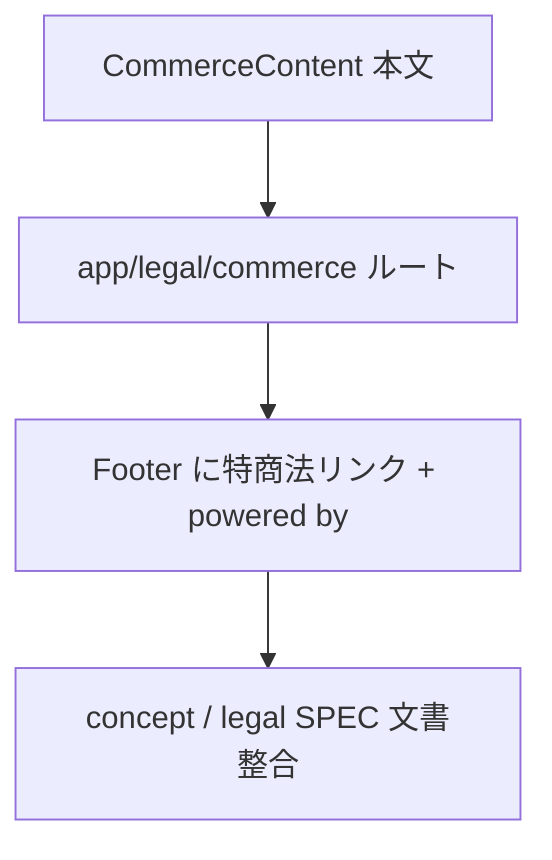

# legal 変更計画書（特商法表記の追加 + 業態整合）

> **入力**: `./001_REVISE_SPEC.md`, `../../concept.md` §1.2/§9/§4.7, Step 2 で読んだ既存実装
> **最終更新**: 2026-06-10

---

## 1. 既存ファイル変更一覧

| ファイル | 変更内容（概要） | リスク | 関連 SPEC § |
|---|---|---|---|
| `components/layout/Footer.tsx` | nav に「特定商取引法に基づく表記」(`/legal/commerce`) リンクを追加。最下部に **"powered by givers.work"** 文言を追加 | 低（追加のみ、レイアウト微調整） | §2.2 / §7.5 |
| `features/legal/legal.test.tsx` | CommerceContent の見出しテスト + metadata テスト + Footer の特商法リンク/"powered by givers.work" テストを追加 | 低 | §003 |
| `docs/concept.md` §1.2 | 「含まないもの: 本サイトでの課金・決済」「特商法表記（不要）」行を、作者応援寄付 + 有料オプション = 課金あり／特商法 必要 に更新 | 中（文書整合、SoT 反転） | §3 |
| `docs/concept.md` §9（リード文 + §9.1 表） | 「課金なし→特商法不要」を「作者応援寄付 + 有料オプション→特商法 必要・作成（`/legal/commerce`）」へ更新。事業者情報の出所を注記 | 中 | §3 |
| `docs/concept.md` §4.7 | apex `givers.work` → shipyard の方針を追記（DNS 切替はユーザー手動、本番反映後） | 低 | §6 |
| `docs/legal/001_legal_SPEC.md` | §5 連携「特商法不要」/ §7 スコープ外「特商法不要」を解消し、UC-LG3 を本仕様に反映（or 本 revise_SPEC を参照する追記） | 低 | §1 |

## 2. 新規ファイル一覧

| ファイル | 責務 | 依存 | LOC 見積 |
|---|---|---|---|
| `app/legal/commerce/page.tsx` | `/legal/commerce` ルート（SSG, metadata, Header/Footer, max-w-2xl レイアウト）。privacy/terms page.tsx と同型 | buildMetadata, Header, Footer, CommerceContent | ~27 |
| `features/legal/CommerceContent.tsx` | 特商法本文（§7.6 草案の SoT）。事業者情報・料金・支払・提供時期・返金を section 構成で表示 | なし（静的） | ~90 |

## 3. 削除ファイル一覧

| ファイル | 削除理由 | 代替 |
|---|---|---|
| （なし） | — | — |

## 4. マイグレーション要否

- DB スキーマ変更: ❌
- 既存データ変換: ❌
- 設定ファイル変更: ❌（DNS apex 切替はインフラ作業でユーザー手動、コード/設定の変更を伴わない）
- ストレージパス変更: ❌
- → **Phase 5 REVISE_MIGRATION は生成しない**

## 5. 実装 Phase 分割（`/flow:tdd` 連携）

### Phase 1（RED→GREEN→IMPROVE）— 特商法ページ
- 対象: `features/legal/CommerceContent.tsx` + `app/legal/commerce/page.tsx` + legal.test.tsx（CommerceContent 見出し / metadata）
- ゴール: `/legal/commerce` が §7.6 の全項目を含めて表示され、index 可

### Phase 2 — Footer 拡張
- 対象: `components/layout/Footer.tsx` + legal.test.tsx（特商法リンク / "powered by givers.work"）
- ゴール: 全ページのフッタに特商法リンクと "powered by givers.work" が出る

### Phase 3 — 設計文書整合（非コード）
- 対象: concept.md §1.2/§9/§4.7 + legal/001_legal_SPEC.md
- ゴール: 「課金なし／特商法不要」記述の反転、SoT 整合（audit 再発防止）

## 6. 依存関係順序

## 7. ロールアウト計画

| ステップ | 内容 | 期日 | 検証方法 |
|---|---|---|---|
| 1 | 実装 + unit GREEN | — | `npm run test` |
| 2 | main マージ → Vercel 自動デプロイ | — | 本番 `/legal/commerce` 200 + 文言目視 |
| 3 | Stripe 審査に URL 提示 | ユーザー | Stripe ダッシュボード |
| 4 | （別ステップ・ユーザー手動）apex `givers.work` → shipyard DNS 切替 | 審査通過後 | `https://givers.work` が shipyard を配信 |

## 8. リスク・注意点

- **SoT 反転の取りこぼし**: concept §1.2/§9 の「課金なし」が複数箇所にあるため、grep で全箇所を反転（audit の SoT 整合チェック対象）。
- **PII との誤判定**: 事業者の屋号/住所/電話/メールは特商法の**法定公開項目**であり SEC-001（PII 秘匿）の対象外。コードレビューで「ハードコードされた連絡先」を PII 漏洩と誤検出しないよう、CommerceContent にコメントで明示。
- **i18n**: 既存 legal は i18n catalog 未使用（直書き日本語の静的ページ）。CommerceContent も同方針（既存と統一）。CLAUDE.md の i18n 準拠レビューは「catalog を備えた UI」が対象であり、legal 静的ページは既存どおり JA 直書きで整合。
- **"powered by givers.work"**: apex を shipyard に向けた後は自己参照的になるが、ブランド帰属表記として要望どおり掲載。

## 9. 完了の定義 (DoD)

- [ ] Phase 1〜3 完了
- [ ] 単体テスト GREEN（CommerceContent 見出し / metadata / Footer リンク + powered by）
- [ ] カバレッジ目標維持（行 80% / 分岐 70%）
- [ ] `/legal/commerce` が §7.6 全項目を表示
- [ ] Footer に特商法リンク + "powered by givers.work"
- [ ] concept §1.2/§9/§4.7 + legal/001 SPEC の SoT 整合（特商法 不要 → 必要）
- [ ] `/dev-review` 通過
- [ ] （DoD 外・ユーザー）本番反映後の Stripe 審査提示 / apex DNS 切替

## 10. 更新履歴
| 日付 | 変更概要 | 実行者 |
|---|---|---|
| 2026-06-10 | 初版作成 | /flow:revise |
