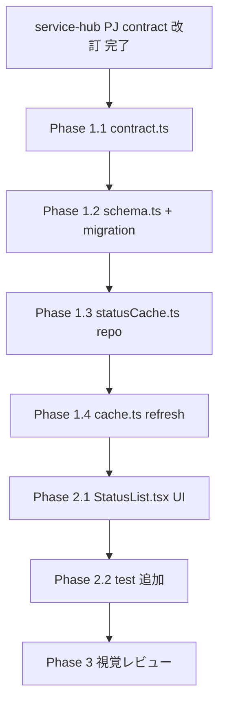

# service-status 変更計画書 (service-icons)

> **入力**: [`./001_REVISE_SPEC.md`](./001_REVISE_SPEC.md), [`../../concept.md`](../../concept.md) §1.4, 直前 commit 7e775a1 (hub-client drift 修正)
> **最終更新**: 2026-05-28

---

## 1. 既存ファイル変更一覧

| ファイル | 変更内容 (概要) | リスク | 関連 SPEC § |
|---|---|---|---|
| `lib/hub/contract.ts` | `serviceStatusSchema` に `iconUrl: z.string().url().optional().catch(undefined)` 追加 (camelCase、直前 7e775a1 修正と整合、無効 URL は graceful に undefined に降格) <!-- spec-review R3 --> | 低 (optional + catch、後方互換 + graceful) | §2.2, §7.3 |
| `lib/db/schema.ts` | `serviceStatusCache` テーブルに `iconUrl: text("icon_url")` (nullable) 追加 | 中 (DB schema 変更、migration 要) | §2.3, §7.3 |
| `lib/db/repositories/statusCache.ts` | `StatusCacheInput` 型に `iconUrl?: string \| null` 追加。`upsertMany` の **明示列挙 values mapping** に `iconUrl: r.iconUrl ?? null` 追加 + `onConflictDoUpdate.set` に `iconUrl: sql\`excluded.icon_url\`` 追加。**明示列挙パターンなので自動継承されない、行追加必須**。`listAll` は `$inferSelect` 経由で iconUrl 自動含有 <!-- spec-review R1: 明示列挙 mapping の漏れリスク強調 --> | **中** (明示列挙 mapping = 行追加漏れリスク、U-IC5 + 既存 U-3 拡張で機械担保) | §2.2, §7.3 |
| `lib/hub/cache.ts` | `refreshStatusCache` の **明示列挙 mapping** に `iconUrl: s.iconUrl ?? null` 追加。**明示列挙パターン (spread 不使用、安全サブセット強制) なので自動継承されない、行追加必須**、漏らすと DB に永遠に保存されない <!-- spec-review R1 --> | **中** (mapping 漏れリスク高、既存 U-3 拡張で iconUrl assertion 担保) | §2.2 |
| `components/status/StatusCard.tsx` | **StatusCardService 型に `iconUrl?: string \| null` 追加** + 単一行 UI 先頭に icon 表示領域 (32×32px、丸角 8px)。`iconUrl` あり → `` (装飾画像、WCAG 1.1.1)、不在/失敗 → `
` イニシャル (`Array.from(name)[0]`) + `var(--color-brand-bg-soft)` 背景 (design SoT §6 ミニマル路線、[論点-007] accepted) <!-- spec-review R2 + R4 + D1 --> | 中 (UI 変更、視覚レビュー要、a11y 装飾画像) | §7.1 UC-S1 |
| `features/service-status/StatusList.tsx` | **StatusListItem 型に `iconUrl?: string \| null` 追加** (StatusCard へ passthrough のみ、表示集約は StatusCard) <!-- spec-review R2: StatusList は型 + passthrough shell、表示集約は StatusCard --> | 低 (型拡張 + passthrough) | §7.1 UC-S1 |
| `app/page.tsx` / `app/services/page.tsx` | repo `listAll()` 戻り値が `$inferSelect` 経由で iconUrl 自動含有 → 変更不要、型透過の動作確認のみ <!-- spec-review R2: 型自動継承で mapping 不要、動作確認だけ --> | 低 (確認のみ) | §7.1 |
| `features/service-status/service-status.test.tsx` | (Phase 3) 既存 7 件は維持 + icon 表示 / フォールバック / 読み込み失敗 + a11y `alt=""` 検証 test 追加 | 低 | §7.4 + 003_REVISE_UNIT_TEST.md |

## 2. 新規ファイル一覧

| ファイル | 責務 | 依存 | LOC 見積 |
|---|---|---|---|
| `lib/db/migrations/<auto-gen>_add_icon_url_to_service_status_cache.sql` | drizzle-kit generate で自動生成される migration SQL | (drizzle) | ~5 |
| (任意) `features/service-status/ServiceIcon.tsx` | icon 表示 + フォールバックを `<ServiceIcon name={name} iconUrl={iconUrl} />` で再利用可能化 | _shared/ui | ~30 |

> ServiceIcon component の外出しは StatusList.tsx 内インライン実装でも OK (LOC 30 程度、後段で必要なら refactor)。`/flow:tdd` 着手時に判断。

## 3. 削除ファイル一覧

| ファイル | 削除理由 | 代替 |
|---|---|---|
| (なし) | — | — |

## 4. マイグレーション要否

- DB スキーマ変更: ✅ ([`005_REVISE_MIGRATION.md`](./005_REVISE_MIGRATION.md))
- 既存データ変換: ❌ (既存 row は iconUrl NULL のまま、refresh 時に update)
- 設定ファイル変更: ❌
- ストレージパス変更: ❌

→ **Phase 5 REVISE_MIGRATION 必須**。

## 5. 実装 Phase 分割

### Phase 1 (RED→GREEN→IMPROVE) — 基盤 (contract + schema + repo + cache + migration)
- 対象:
  - lib/hub/contract.ts (iconUrl 追加 + test U-C3)
  - lib/db/schema.ts (iconUrl column)
  - drizzle-kit generate で migration SQL 生成
  - drizzle-kit migrate で Neon dev branch apply (`! npm run db:migrate`)
  - lib/db/repositories/statusCache.ts (型 + upsert)
  - lib/hub/cache.ts (refresh で iconUrl 渡す)
  - 各 unit test 追加 (contract / repo / cache)
- ゴール: contract test green + schema migration apply 完了 + repo/cache test green

### Phase 2 (RED→GREEN→IMPROVE) — UI (StatusList + フォールバック)
- 対象:
  - features/service-status/StatusList.tsx (icon 表示 region 追加)
  - (任意) features/service-status/ServiceIcon.tsx 外出し
  - features/service-status/service-status.test.tsx (icon あり/不在/読み込み失敗 の 3 ケース追加)
- ゴール: UI 表示 green + フォールバック動作確認 + 全 unit test green
- (任意) [論点-007] design トークン確認 = ブランドカラー背景の単一色採用

### Phase 3 (視覚レビュー、本コマンド外)
- `/flow:design --review-only` で headless スクショ視覚レビュー (Playwright scaffold = [論点-005] 待ち)
- icon 表示 + フォールバックの両方を視覚確認

## 6. 依存関係順序

- **A (service-hub PJ contract 改訂) は本 PJ 外部依存**。完了前に shipyard tdd を着手すると、ローカル動作確認時に iconUrl 不在 = フォールバックのみ確認可 (icon 表示は dummy 注入 or service-hub 改訂後に確認)。

## 7. ロールアウト計画

| ステップ | 内容 | 期日 | 検証方法 |
|---|---|---|---|
| 0 | service-hub PJ で `/flow:revise service-icons` 起動 (連動改修対象、別 repo / 別 session) | 本 revise より前 (or 並行) | service-hub PJ AI_LOG + commit |
| 1 | 本 revise 設計 commit (本セッション) | 2026-05-28 | git log + AI_LOG D20260528_009 |
| 2 | `/flow:tdd revise_service-icons_*` で Phase 1 + Phase 2 実装 | 設計直後 | 全 unit test green + drizzle migration apply 成功 (Neon dev branch) |
| 3 | ローカル動作確認 (`! npm run dev` + `! bash scripts/cron-refresh.sh` + ブラウザ LP reload) | Phase 2 後 | StatusList で hana-memo 表示 + service-hub から iconUrl 取得時 `` 表示 / 不在時イニシャル |
| 4 | `/flow:design --review-only` 視覚レビュー | (任意、Playwright scaffold 待ち = [論点-005]) | charter §2.2 + design SoT §6 整合 |
| 5 | 本番デプロイ前に Neon main branch に migration apply (Phase 3 release で実施) | release 時 | 本番 cache 更新で iconUrl 列追加確認 |
| 6 | 本番デプロイ + Vercel preview → prod (本セッション外、release session) | release 時 | 公開 URL で表示確認 |

## 8. リスク・注意点

- **service-hub PJ contract 改訂が遅延** → shipyard Phase 1-2 実装は可能だが、ローカル動作確認で iconUrl 不在 = フォールバックのみ確認可。実 icon 表示確認は service-hub 改訂後。
- **migration の本番 apply タイミング** = Phase 3 release 時に Neon main branch apply。preview deploy では dev branch 使う方針 (未デプロイ commit を main に migrate する前に preview で動作確認推奨)。
- **icon URL のドメイン** = service-hub 管理の CDN (例: Cloudflare R2 / Vercel Image Optimization)。**現状 shipyard PJ に CSP 未設定** (grep 確認: `next.config.*` / `middleware.ts` / `app/` に `Content-Security-Policy` / `img-src` / `cspHeader` 無)、よって現状 img 取得制限なし。**将来 CSP 導入時は service-hub CDN ドメインを `img-src` 許可リストに追加必要** (drift 候補、retrofit 対象) <!-- spec-review R5: 現状無問題、将来再評価ポイント -->
- **画像 alt 属性 (a11y)** = **装飾画像扱い `alt="" role="presentation"`** (service name は StatusCard 内で隣接 text として併記され、a11y name は text が担保。装飾画像にすることで screen reader 二重読みを回避、WCAG 1.1.1) <!-- spec-review R4 -->
- **dark mode** (もし将来導入) = フォールバック背景色も dark/light で切替必要 (design トークン経由)。

## 9. 完了の定義 (DoD)

- [ ] service-hub PJ 側 contract 改訂完了 (連動 revise)
- [ ] Phase 1 全 unit test green (contract / schema migration / repo / cache、追加 test 含む)
- [ ] Phase 2 全 unit test green (StatusList icon 表示 / フォールバック / 読み込み失敗)
- [ ] drizzle migration が Neon dev branch + main branch (本番化時) 両方で apply 成功
- [ ] `/flow:design --review-only` 視覚レビュー OK (icon + フォールバック両方、charter §2.2 / design SoT §6 整合) — [論点-005] Playwright 後
- [ ] LP で実 service-hub から取得した icon が表示される (cron-refresh.sh 経由)
- [ ] (任意) `/dev-review` 通過

## 10. 更新履歴

| 日付 | 変更概要 | 実行者 |
|---|---|---|
| 2026-05-28 | 初版作成 — CF-016 (F) 連動改修対象 = service-hub PJ | /flow:revise |
